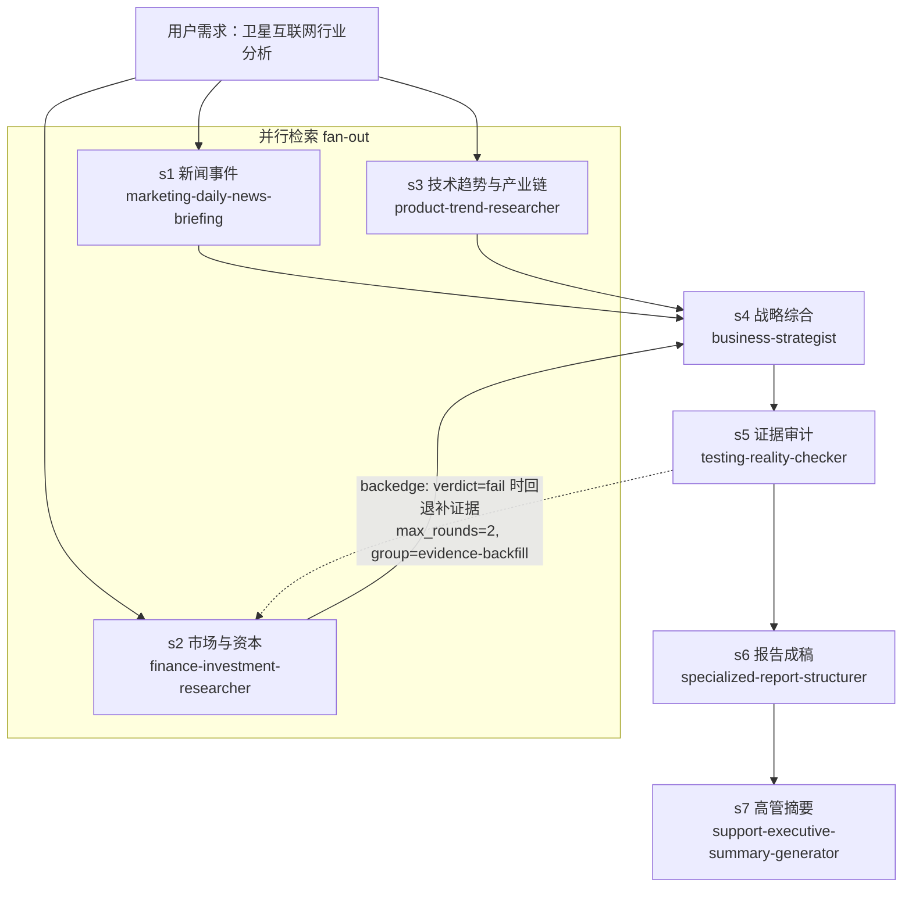

# 卫星互联网行业分析

- **目标**：用户原始需求（原样）：「帮我做一个卫星互联网行业的行业分析」
- **采用的默认参数**（需求未指明，按流程默认值推进）：地域=全球+中国；时间窗=近 1 年为主（可追溯至 2020 格局）；受众=管理层/决策者；深度=全维度（市场规模、竞争格局、技术趋势、产业链、商业模式、政策、风险与机会）
- **结论**：行业价值向「垂直一体化+频谱资产+政府订单」三重壁垒集中；Starlink（75% 在轨垄断、2025 收入 $114 亿二手口径）定义规则，追赶者窗口在 D2D 直连、政府第二曲线与产业链瓶颈卡位（激光终端/批产设备/射频芯片）；全球市场 2025 约 $145.6 亿→2030 约 $334.4 亿（CAGR 18.1%）；ARPU 三年降 33% 为行业性警示；置信度 pass_with_flags
- **任务形状**：含回路有向图——3 路并行检索 fan-out → 战略综合 fan-in → 证据审计 gate（1 条 backedge 回退边：s5→s2，max_rounds=2，**实际未触发**，计数 0/2）→ 报告成稿 → 高管摘要
- **起止时间 / 共多少步 / 成功几步失败几步**：2026-09-03 21:27 ~ 22:15 / 7 步 / 7 成功 0 失败

## 任务流程图（Mermaid）

> 实线=前向数据流（depends_on）；虚线=回退边（s5 审计不通过 → 回退 s2 重新取数，随后 s4/s5 串行重跑，最多 2 轮触顶强制收敛）。

## 文件导航表

| 环节 | 文件 |
|------|------|
| 编排方案 | 10-DAG方案.json |
| 检索·新闻事件（s1） | 30-步骤产出/S1-新闻事件简报.md |
| 检索·市场与资本（s2） | 30-步骤产出/S2-市场与资本底稿.md |
| 检索·技术趋势（s3） | 30-步骤产出/S3-技术趋势底稿.md |
| 战略综合（s4） | 30-步骤产出/S4-战略综合.md |
| 证据审计（s5，含回退轮） | 30-步骤产出/S5-证据审计报告.md |
| 报告成稿（s6） | 30-步骤产出/S6-完整报告.md |
| 高管摘要（s7） | 30-步骤产出/S7-高管摘要.md |
| 执行流水 | 20-执行日志.md |
| 最终成品 | 50-最终报告.md |
| 遗留与偏差 | 90-遗留与偏差.md |

一句话说明「人该怎么读」：先看本文件，再顺着导航表从上到下点开——三路检索底稿看原始证据，S4 看战略判断，S5 看哪些结论被降级，最后看 50-最终报告.md。
