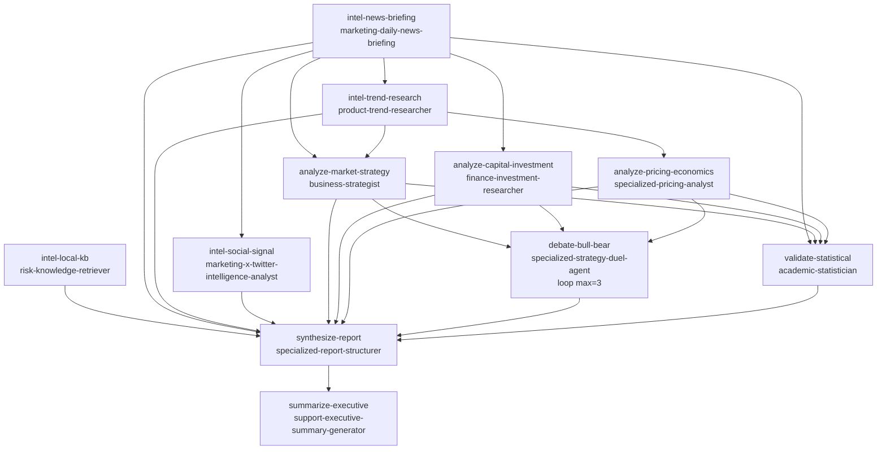

# 商业航天行业分析报告

- **目标**：帮我写一份商业航天行业分析报告
- **结论**：商业航天拐点部分已至但非「行业整体」拐点，而是「头部单点拐点（SpaceX）+ 中尾部出清期」；双引擎=复用降本+星座组网；唯一不可速成壁垒=复用频率工程化沉淀；资本二元分化至极端
- **任务形状**：层级式 DAG + 一个对抗辩论子循环（max_rounds=3）
- **起止时间**：2026-08-26 20:35 起｜共 11 步，全部成功，0 失败

## DAG 图（Mermaid）

## 文件导航表

| 环节 | 文件 |
|------|------|
| 方案 | 10-DAG方案.json |
| 情报采集（4 路并行） | 30-步骤产出/S1-news / S2-trend / S3-social / S4-local |
| 维度分析（3 路并行） | 30-步骤产出/S5-market / S6-capital / S7-pricing |
| 对抗辩论（循环） | 30-步骤产出/S8-debate |
| 统计校验 | 30-步骤产出/S9-statistical |
| 报告合成 | 30-步骤产出/S10-report |
| 高管摘要 | 30-步骤产出/S11-executive |
| 最终成品 | 50-最终报告.md |

**人该怎么读**：先看 50-最终报告.md（结论），再按导航表从上到下点开各步骤产出核对证据链，最后看 90-遗留与偏差.md 了解未竟事项。
