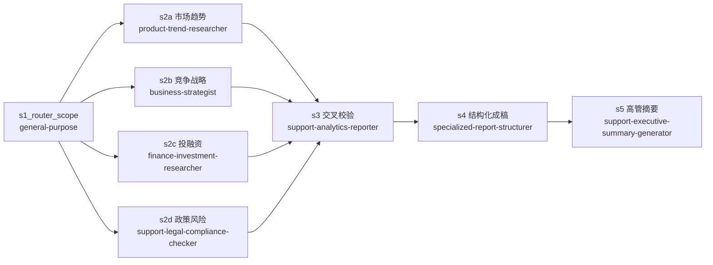

# 商业航天行业分析报告

- **目标**：帮我做一个商业航天行业分析报告（原样）
- **结论**：未运行——角色缺失硬退出（缺 3 个航天领域专业角色，详见 `90-遗留与偏差.md`）
- **任务形状**：一次性 DAG（Router → 4 并行研究 → 交叉校验 → 结构化成稿）
- **起止时间**：2026-08-26 15:32:45 / 共 7 步（设计完成）/ 成功 0 步，执行 0 步，硬退出 1 次

## DAG 图（Mermaid）

## 文件导航表

| 环节 | 文件 |
|------|------|
| 架构师 DAG 方案 | `10-DAG方案.json` |
| 执行日志 | `20-执行日志.md` |
| 角色缺失说明 | `90-遗留与偏差.md` |

**人该怎么读**：先看本文件，再看 `90-遗留与偏差.md` 了解为什么没有产出成品，最后看 `10-DAG方案.json` 了解本可执行的方案全貌。