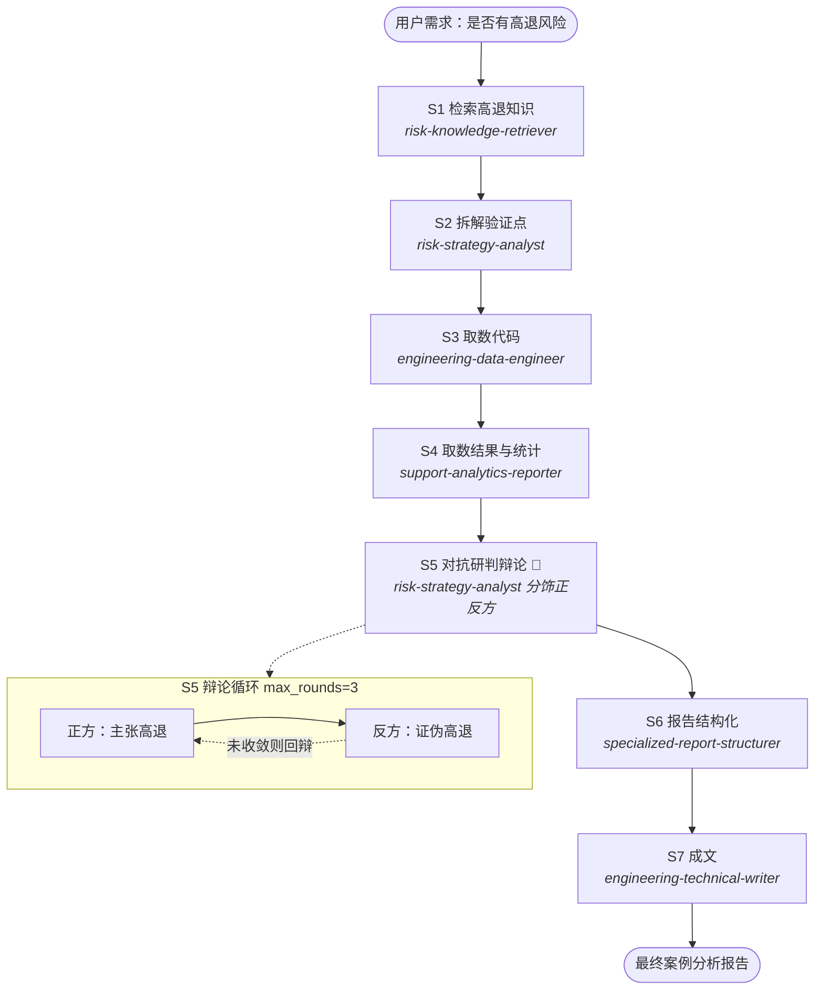

# 高退研判 — 子订单 110206066421203954

> 本文件是 review 的**阅读锚点**。先读这里，再顺着下面的导航表从上到下点开，就能顺完全程。

- **目标**：分析子订单号为 110206066421203954 的订单是否有高退风险，最终产出案例分析报告。
- **结论**：**不构成"高退"**（商家维度零命中，必要条件不满足）；买家单方异常显著 → `verdict=low_risk`，`risk_score=0.28`，`confidence=0.72`。
- **任务形状**：含循环 DAG（S5 对抗辩论循环，`max_rounds=3`，第 1 轮即收敛）。
- **时间**：2026-08-20 ｜ **共 7 步 + 1 个辩论循环轮** ｜ **全部成功**（1 处数据缺口：水位表无权限）。

---

## DAG 图（Mermaid）

---

## 文件导航表

| 环节 | 角色 | 文件 |
|------|------|------|
| DAG 方案 | 架构师 | `10-DAG方案.json` |
| S1 检索知识 | risk-knowledge-retriever | `30-步骤产出/S1-检索知识.md` |
| S2 拆解验证点 | risk-strategy-analyst | `30-步骤产出/S2-验证点.md` |
| S3 取数代码 | engineering-data-engineer | `30-步骤产出/S3-取数代码.md` |
| S4 取数与统计 | support-analytics-reporter | `30-步骤产出/S4-数据事实.md` |
| **真实取数脚本 + 结果** | （主程序执行） | `40-代码与结果/取数脚本.py` + `取数脚本-运行结果.txt` |
| S5 对抗辩论 | risk-strategy-analyst | `30-步骤产出/S5-对抗研判.md` |
| S6 报告结构化 | specialized-report-structurer | `30-步骤产出/S6-报告大纲.md` |
| S7 成文 | engineering-technical-writer | `30-步骤产出/S7-最终报告.md` |
| 执行流水 | 主程序 | `20-执行日志.md` |
| 遗留与偏差 | — | `90-遗留与偏差.md` |

---

## 阅读建议

1. 先看 **`20-执行日志.md`** 建立时间线直觉（谁先谁后、哪一步产出了什么）。
2. 顺着 **`30-步骤产出/`** 的 S1→S7 编号读每个角色干了什么。
3. 重点看 **`40-代码与结果/`** —— 这里代码和它的运行结果放在一起，能对着看。
4. 结论的"否决锚点"在 **S5**：商家维度零命中断了高退必要条件。
